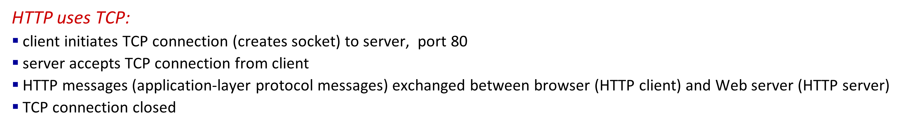
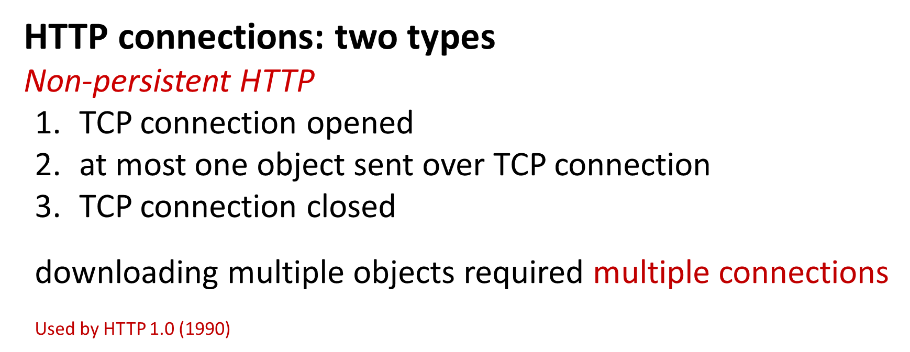
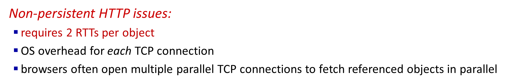
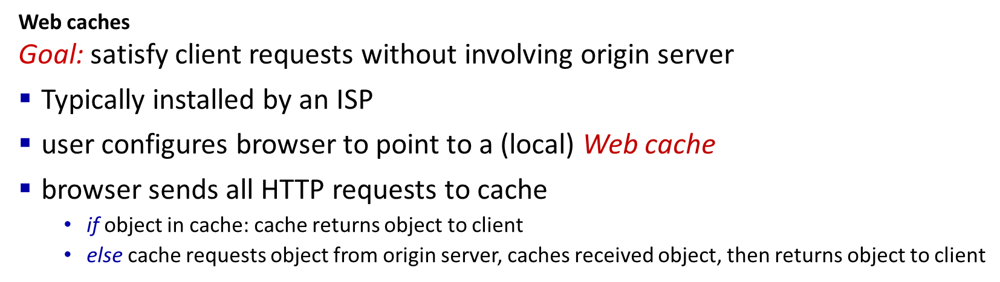
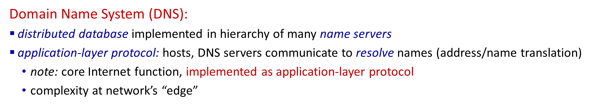
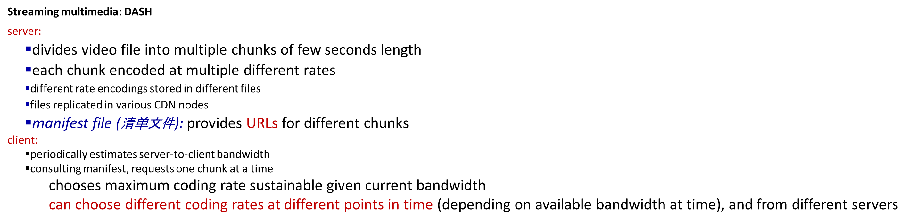

## 一些信息
* **Dijkstra算法、动态规划算法那前后一整块**都是期末重点
* 期末题型：
    * 20道选择题，共40分
    * 5道判断题，共10分
    * 5道综合大题
        * 其中2道简答题（概念题，实在不会用英文表述可以用一点点中文），e.g.解释一下ARP是干什么的
        * 3道计算题
        * **链路层、网络层和运输层，一层一道大题**
    * 没有附加题，难度应该没有作业高
    * 可以带计算器
* 重点中的重点：**HTTP、DNS、**
* 第一章：分层、delay、各种交换、协议等
* 第二章：TCP、UDP、HTTP、DNS，**P2P公式不用专门看**
    * **第二章没有什么计算题，应该会有一些问答题**，就是基础的原理、概念、简答
* 第三章：socket、多路复用、SNMP不用管、checksum计算也不考、rdt主要理解原理和几个问题，具体非常细节的不会抠比如状态转移之类的、GBN和具体的算法、TCP，注意报文结构中的RSF，ACK和sequence number对应的关系，connection management，三次握手的过程的SYN和ACK（两次的问题不用管）、拥塞控制慢启动的算法、QUIC不用管、UDP
* 第四章：longest prefix matching一定要掌握、IP addressing、子网（比如两个地址之间通信需不需要路由器）、特殊IP地址、专用地址不用专门记范围、路由转发算法一定要会，比如怎么根据转发表看下一跳，下一跳之后怎么处理，怎么计算等、DHCP、NAT是关键，一定要好好理解、如果服务器在里面，内网怎么往外网通信（需要有一个服务器来进行帮助，从内网发起，不能从外网发起，把外网IP地址告诉内网，叫做NAT的穿透）、tunneling和encapsulation理解一下就行、转发知道基本原理、OpenFlow的flow table有哪些项（field）和基本原理，不需要掌握它的计算
* 第五章和第六章（是重点）：SDN、数据平面和控制平面、Dijkstra最短路径算法一定要掌握、distance vector algorithm（动态规划算法，Bellman-Ford，BF）算法的基本原理和计算方法、count-to-infinity problem（上课讲的，翻聊天记录）一定要好好看、域内和域间路由协议可能会考简答题、路径向量协议、BGP、ICMP、每一章每一层的service都要搞清楚、CRC一定要会算（也是之前上课讲的，翻聊天记录）、CSMA这些的基本原理和算法一定要搞清楚、binary backoff也一定要好好看、mac address（和IP address的区别之类的）、ARP和跨网络的ARP怎么进行计算一定要搞清楚，ARP和IP相结合怎么进行通信、topology、以太网、switch交换机的自学习算法一定要搞清楚、VLAN知道概念就行、RTS和CTS、MPLS掌握基础原理，转发计算不用掌握

## 知识框架
### 关键词缩写解释

p2p

### FAQ

### 重要知识点

### 应用层

#### 应用层框架

### 运输层

### 网络层：数据平面

### 网络层：控制平面

### 链路层

### 物理层